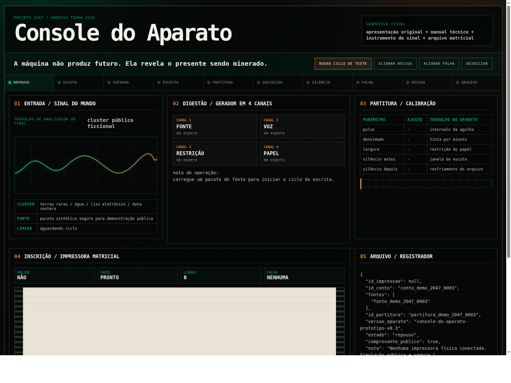

# Field note: command center smoke prototype

Date: 2026-05-17  
Status: public research receipt  
Prototype: `06-prototypes/command-center/`  
Screenshot: `assets/prototype-screenshots/command-center-v2-2026-05-17.png`

## Purpose

This note records the first public command center smoke prototype for **Projeto 2047 / Arquivo Terra Viva**.

The goal was not to build the final interface of the work. The goal was to test whether the generative apparatus can be represented as an operator console rather than as a generic AI dashboard.

The prototype makes the research loop visible:

```txt
source signal
  -> short story
  -> sonic score
  -> printer simulation
  -> ledger record
```

## Public boundary

This test uses fictional and generic data only.

It does not include:

- private conversations;
- institutional documents;
- budgets;
- supplier data;
- internal infrastructure;
- credentials;
- final artwork text;
- model training corpus;
- unapproved material from the co-authorial process.

## Visual direction

The prototype follows the design direction documented in:

- `06-prototypes/command-center/DESIGN-DIRECTION.md`
- `06-prototypes/command-center/references/manuals-plus-seeds.md`
- `06-prototypes/command-center/references/manuals-plus-reference-map.md`
- `06-prototypes/command-center/references/selected-reference-set.md`

The working visual formula is:

```txt
existing co-authorial presentation language
+ Internet Archive Manuals Plus
+ operator console
+ dot-matrix archive
```

The term `dashboard` is intentionally avoided. The preferred frame is `apparatus console` or `operator console`.

After the first public version, the console interface was translated to Brazilian Portuguese and recolored to follow the chromatic direction of the existing co-authorial presentation: dark field, white typography, green/teal signal accents, orange section markers, and restrained technical panels.

## Reference set translated into interface components

The second command center iteration translated the selected Manuals Plus references into concrete UI components.

| Reference direction | Console component |
| --- | --- |
| Marconi TK 1803 Control Panel | Apparatus state strip |
| HP 3562A Dynamic Signal Analyzer | Source signal trace |
| Tektronix PI-210 Word Generator | 4-channel story generator |
| Tektronix PI-100A Clock Generator | Score calibration table |
| Teletype AN/FGC-36 Page Teletypewriter Set | Printer feed and fault panel |
| Tau-Tron MR-1 Data Logging Printer | Public receipt sheet |
| biomation 8100 Waveform Recorder | Ledger recorder |
| Newbury 8009 Visual Display Terminal | Operator modes and screen logic |

## Components implemented

The prototype now includes:

1. **Apparatus state strip**  
   States: `IDLE`, `LISTENING`, `INGESTING`, `WRITING`, `SCORING`, `PRINTING`, `SILENCE`, `FAULT`, `REFUSAL`, `ARCHIVED`.

2. **Source signal trace**  
   A simulated signal panel for the fictional public signal cluster.

3. **4-channel story generator**  
   Channels: `SOURCE`, `VOICE`, `CONSTRAINT`, `PAPER`.

4. **Score calibration table**  
   Fields: pulse, density, line width, silence before, silence after.

5. **Printer feed and fault panel**  
   Fields: online, paper feed, line count, fault.

6. **Ledger recorder**  
   Event trace plus public JSON ledger record.

7. **Maintenance / refusal page**  
   Troubleshooting-style table for refusal and fault conditions.

8. **Public receipt sheet**  
   A simplified receipt for the simulated cycle.

## Interactions implemented

The current prototype includes four controls:

- `Run smoke cycle`
- `Trigger refusal`
- `Trigger fault`
- `Reset`

These controls are intentionally procedural. They should feel closer to operating a machine than browsing a web dashboard.

## Smoke cycle behavior

When `Run smoke cycle` is triggered, the console moves through:

```txt
LISTENING
INGESTING
WRITING
SCORING
PRINTING
SILENCE
ARCHIVED
```

The cycle uses a fictional source packet about rare earths, data centers, water, and e-waste. It then displays a short fictional story, calibrates a sonic score, simulates paper output, logs events, and produces a receipt.

## Refusal behavior

The `Trigger refusal` control tests the principle that not every source should become text.

The console enters `REFUSAL`, flattens the signal trace, logs a refusal, and states:

```txt
No story was generated.
The apparatus entered silence instead of producing ornamental certainty.
```

This is important because the work should not reward generation at any cost.

## Fault behavior

The `Trigger fault` control tests mechanical interruption.

The console enters `FAULT`, changes paper feed to `JAM`, logs a printer fault, and produces a receipt with no print.

Fault is treated as a first-class apparatus state, not as an implementation error.

## Screenshot



## What worked

- The prototype now reads less like a SaaS dashboard and more like an apparatus console.
- The Manuals Plus references translate well into UI grammar.
- State language helps the work become accountable.
- Refusal and fault are visible as meaningful states.
- The ledger feels closer to an event recorder than a database table.
- The score table makes sonic cadence legible.

## What remains unresolved

- The visual relation to the existing presentation language still needs co-author review.
- The prototype uses a fictional story and does not validate the final literary voice.
- The score is symbolic and not yet connected to real printer timing.
- The printer simulation is visual only.
- No real FX-2190 printer event is connected yet.
- The public/private boundary of future generated samples still needs approval.
- The exhibition duration remains unconfirmed.

## Next actions

1. Enable GitHub Pages for the static prototype.
2. Inspect 6 to 8 selected Manuals Plus references page by page.
3. Refine visual hierarchy after manual inspection.
4. Add a `Save receipt` output as markdown or JSON.
5. Add multiple score presets.
6. Add a real terminal print simulation receipt.
7. Prepare a short co-author review packet for Giselle.

## Research conclusion

The command center should not be a dashboard that explains the work from above.

It should be an apparatus console: a technical page in motion, where source, story, cadence, paper, failure, refusal, and archive become visible as one system.
