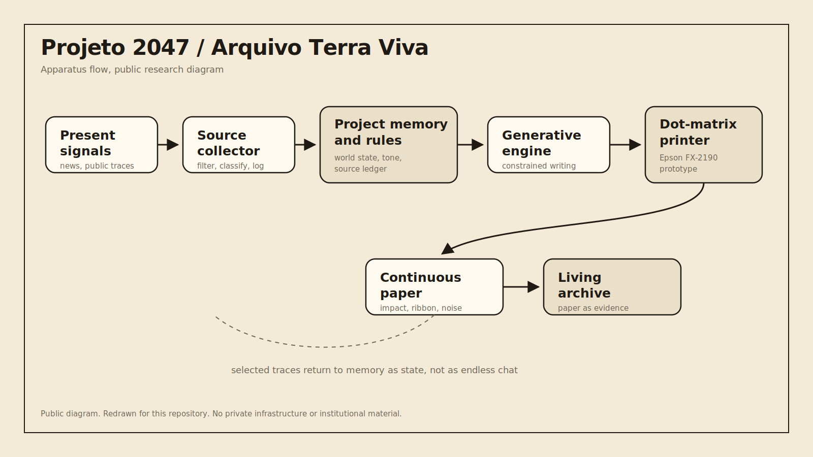
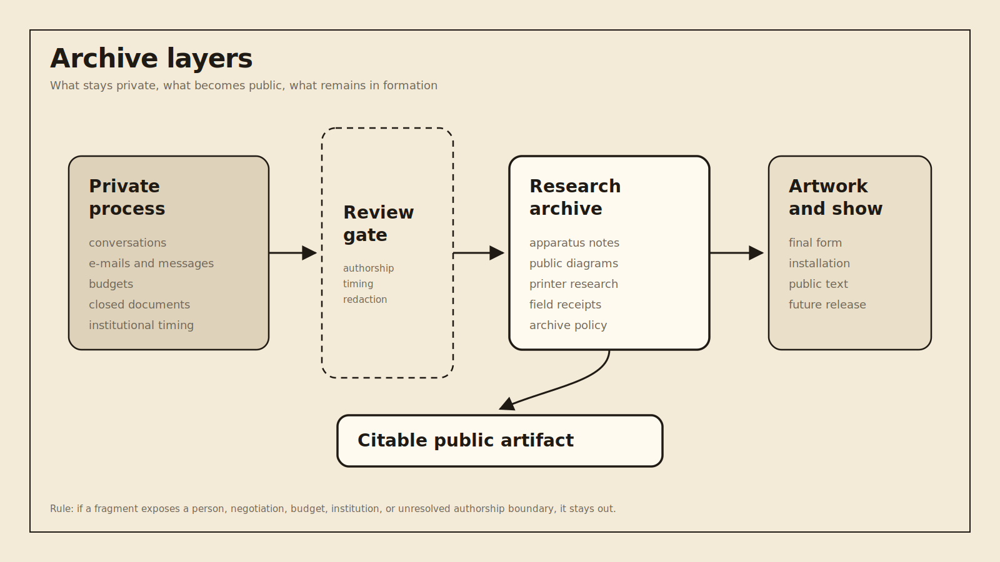
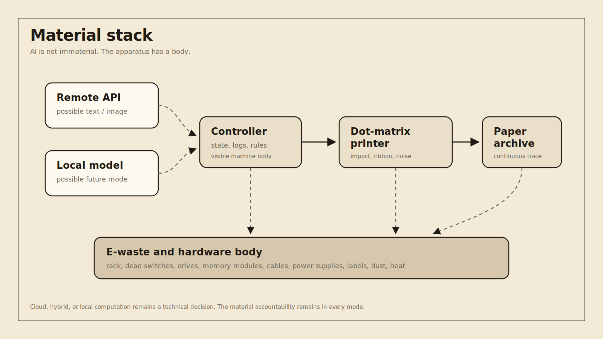

# Diagrams

Public, redrawn diagrams for the research archive.

These diagrams are created specifically for this repository. They do not export or copy private presentation slides, institutional decks, or internal production material.

## Visual rule

The diagrams use a light editorial system: warm paper, dark ink, monospaced labels, few colors, and clear hierarchy.

They are meant to behave as public research artifacts, not production schematics and not SaaS-style architecture diagrams.

## Current diagrams

### Apparatus flow



`apparatus-flow.svg` shows the core loop:

```txt
present signals
  -> source collector
  -> project memory and rules
  -> generative engine
  -> dot-matrix printer
  -> continuous paper
  -> living archive
```

### Archive layers



`archive-layers.svg` shows the boundary between private process, review gate, public research archive, artwork / exhibition, and future citation.

### Material stack



`material-stack.svg` shows computation as a material stack: remote or local AI, controller, printer, paper archive, and e-waste / hardware body.

## Diagrams still needed

- printer archive flow;
- hardware body map;
- generative loop;
- failure and recovery loop;
- future physical layout diagram, only after public clearance.

## Public boundary

Do not include internal IPs, credentials, private locations, supplier details, budgets, institutional timing, or unapproved exhibition layout.
